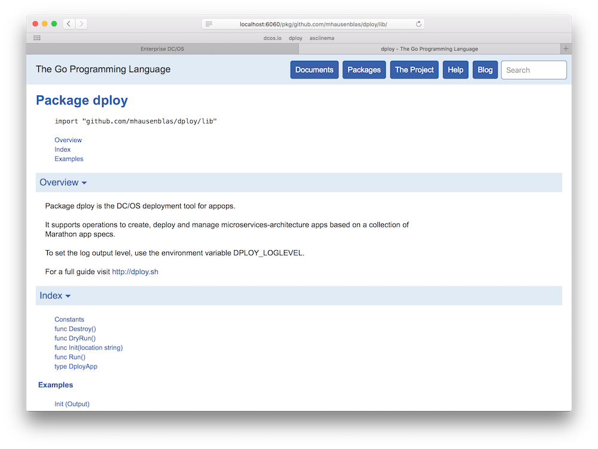

# dploy

The [DC/OS](https://dcos.io) deployment tool for appops allows you to create, deploy and manage services and apps composed of microservices (µS):

- It is simple: it has 8 commands and that's that.
- It is stateless: state is exclusively kept in (local) descriptor and spec files (a collection of Marathon app specs).
- It is self-contained: written in Go, `dploy` is a single binary incl. all dependencies.

Before you dive in, see it in action:

## Installation

From source:

    $ go get github.com/mhausenblas/dploy

To simplify the [DC/OS oauth](https://dcos.io/docs/1.7/administration/security/) handling, you can create a SSH tunnel from your local machine to the DC/OS master like so:

    $ ssh -i ~/.ssh/MYKEY core@MYMASTER -f -L 8080:localhost:8080 -N

From here on, you can use `http://localhost:8080` for the `marathon_url` attribute in the `dploy.app` file.

## Dependencies

- [DC/OS 1.7](https://dcos.io/releases/1.7.0/)
- [github.com/gambol99/go-marathon](https://github.com/gambol99/go-marathon), an API library for working with Marathon.
- [github.com/Sirupsen/logrus](https://github.com/Sirupsen/logrus), a logging library.

## Workflow

### Commands

- [x] `dploy init` … creates a new µS-based app for you
- [x] `dploy dryrun` … validates deployment of the µS-based app
- [x] `dploy run`… launches the µS-based app using the Marathon API
- [x] `dploy destroy`… tears down µS-based app using the Marathon API
- [ ] `dploy ls` … lists the resource definitions of the µS-based app
- [ ] `dploy ps` … lists runtime properties of the µS-based app
- [ ] `dploy update`… updates runtime properties of the µS-based app
- [ ] `dploy publish` … publishes the the µS-based app into the DC/OS Universe

Additional things planned:

- Transparent handling of secrets with [Vault](https://github.com/brndnmtthws/vault-dcos)
- advanced µS examples using linkerd, VAMP

### Logging

To set the log output level for `dploy`, use the environment variable `DPLOY_LOGLEVEL`. 

For example, to set it globally use:

    $ export DPLOY_LOGLEVEL=debug

Of course, you can also set the log output level on a per-run basis, using `$ DPLOY_LOGLEVEL=info dploy dryrun`. Note that the default value, that is, if you don't set the environment variable, is `DPLOY_LOGLEVEL=error`.

### Docs

To view the `dploy` package docs locally, do the following in your Go workspace:

    $ mkdir -p $GOPATH/github.com/mhausenblas/ && cd $GOPATH/github.com/mhausenblas/
    $ git clone https://github.com/mhausenblas/dploy.git && cd dploy
    $ godoc -http=":6060"

If you now visit [http://localhost:6060/pkg/github.com/mhausenblas/dploy/lib/](http://localhost:6060/pkg/github.com/mhausenblas/dploy/lib/) in your favorite Web browser you should be able to see the `dploy` package docs:

