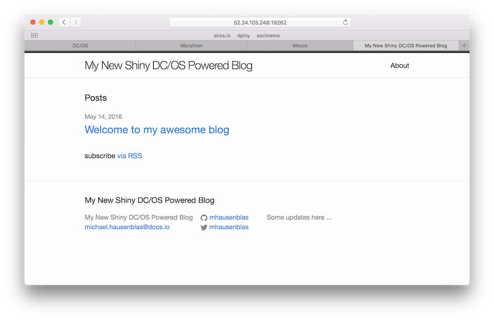

# Blog2Go example

In this example, we will walk through setting up and using Jekyll, a popular static blogging platform, via dploy.

## Preparation

You'll need a `dploy.app` app descriptor with [a content](https://github.com/mhausenblas/s4d/tree/blog2go) looking like the following (replace with your own values):

```
marathon_url: http://localhost:8080
app_name: myblog
repo_url: https://github.com/mhausenblas/s4d
public_node: 52.24.105.248
trigger_branch: blog2go
```

In addition you'll need a GitHub Personal Access Token and make it available via a `.pat` file, see the [observer docs](../../observer/) for details. 

## Launch

To launch the blog, do the following:

```bash
$ dploy dryrun
dploy dryrun
    .___        .__
  __| _/______  |  |    ____  ___.__.
 / __ | \____ \ |  |   /  _ \<   |  |
/ /_/ | |  |_> >|  |__(  <_> )\___  |
\____ | |   __/ |____/ \____/ / ____|
     \/ |__|                  \/
This is dploy version 0.8.3, using workspace [/Users/mhausenblas/Documents/repos/mhausenblas/s4d]
Please visit http://dploy.sh to learn more about me,
report issues and also how to contribute to this project.
=========================================================
🗣	Kicking the tires! Checking Marathon connection, descriptor and app specs ...
🙌	Found DC/OS Marathon instance
🙌	Found an app descriptor
🙌	Found 1 app spec(s) to deploy
🙌	Found stuff I need for push-to-deploy:
	GitHub repo: https://github.com/mhausenblas/s4d
	Public node: 52.24.105.248
	GitHub personal access token: *****************************************
	Trigger branch: blog2go
🗣	Now you can use `dploy ls` to list resources of your app
	or `dploy run` to launch it via Marathon.
```

And if everything looks fine, then:

```bash
$ dploy run
    .___        .__
  __| _/______  |  |    ____  ___.__.
 / __ | \____ \ |  |   /  _ \<   |  |
/ /_/ | |  |_> >|  |__(  <_> )\___  |
\____ | |   __/ |____/ \____/ / ____|
     \/ |__|                  \/
This is dploy version 0.8.3, using workspace [/Users/mhausenblas/Documents/repos/mhausenblas/s4d]
Please visit http://dploy.sh to learn more about me,
report issues and also how to contribute to this project.
=========================================================
🗣	OK, let's rock and roll! Trying to launch your app ...
🙌	Launched your app!
|🗣	Now you can use `dploy ps` to list processes
	or `dploy destroy` to tear down the app again.
```

To find out where your blog is serving and available on the public Internet, do the following (for AWS/CoreOS):

```bash
$ BLOG2GO_IP=$(echo "curl -s ifconfig.ca" | dcos node ssh --master-proxy --mesos-id=$(dcos task --json | jq --raw-output '.[] | select(.name == "blog2go.dployex") | .slave_id') 2>/dev/null) 
$ BLOG2GO_PORT=$(dcos marathon task list --json | jq "map(select(.appId==\"/dployex/blog2go\").ports[0])" | tail -2 | head -n 1 | cut -c 3-)
$ BLOG2GO_URL=http://$BLOG2GO_IP:$BLOG2GO_PORT/
```
Now, if you paste the output of `echo $BLOG2GO_URL` in your browser you should see the following:



## Publishing posts

Now edit in your repo `myblog/_posts/` for example, create a new post or edit an existing, such as `2016-05-14-welcome-to-jekyll.markdown`. Once you've saved the changes, do:

```bash
$ git add myblog/*
$ git commit -m "Publishing first time via dploy"
$ git push
```

TODO: insert screen shot here