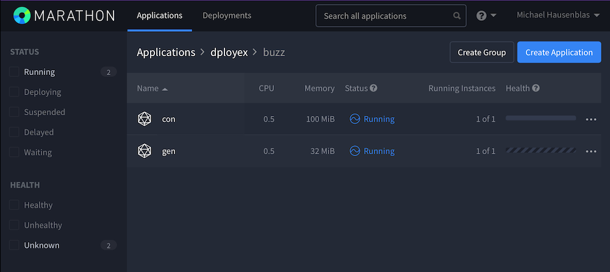

# The buzz example

The buzz example is a [service](buzz.json) consisting of two µS: a generator and a consumer, using a manual routing via [Mesos-DNS](https://dcos.io/docs/1.7/usage/service-discovery/mesos-dns/).

## buzz generator

The generator `/dployex/buzz/gen` serves a list of buzzwords, per default `cloud native hyperscale hybrid container microservices architecture`. It uses the [python:3](https://hub.docker.com/_/python/) Docker image to expose this list of buzzwords on port `8888`:

```javascript
"cmd": "echo cloud native hyperscale hybrid container microservices architecture >index.html && python3 -m http.server 8888",
"container": {
	"type": "DOCKER",
	"docker": {
		"image": "python:3",
		"network": "BRIDGE",
		"portMappings": [
			{
				"containerPort": 8888,
				"hostPort": 0
			}
		]
	}
```

Once deployed, Marathon will make sure that the container port `8888` is mapped to a random port on a public DC/OS node and the µS itself will be available [due to Mesos-DNS](https://dcos.io/docs/1.7/usage/service-discovery/mesos-dns/service-naming/) via the FQDN `gen-buzz-dployex.marathon.mesos`.


## buzz consumer

The consumer `/dployex/buzz/con` is a simple [Python app server](buzzcon.py) that discovers the physical IP and port of the generator through Mesos-DNS and repeats the content it receives from it 10 times, again exposing the result via the `python:3` Docker image on its container port `8888`:

```javascript
"cmd": "curl -OsL https://raw.githubusercontent.com/mhausenblas/dploy/master/examples/buzz/buzzcon.py && python3 buzzcon.py",
"container": {
	"type": "DOCKER",
	"docker": {
		"image": "python:3",
		"network": "BRIDGE",
		"portMappings": [
			{
				"containerPort": 8888,
				"hostPort": 0
			}
		]
	}
},
```

To execute the buzz example, first make sure that you've actually got it installed via `dploy init` locally:

```bash
~/tmp $ DPLOY_EXAMPLES=buzz dploy init
This is dploy version 0.5.3
	Using workdir: ./
	Please visit http://dploy.sh to learn more about me,
	report issues and also how to contribute to this project.
================================================================================
🗣	Initializing your app ...
🙌	Done initializing your app:
		Set up app descriptor in /Users/mhausenblas/tmp/dploy.app
		Created app spec directory /Users/mhausenblas/tmp/specs
		Initialized app spec directory with the buzz example
🗣	Now it's time to edit the app descriptor and adapt or add Marathon app specs. Next, you can run `dploy dryrun`

~/tmp $ ls -al specs/
total 8
drwxr-xr-x  2 mhausenblas  staff   102B  2 May 16:30 .
drwxr-xr-x  3 mhausenblas  staff   136B  2 May 16:30 ..
-rw-r--r--  1 mhausenblas  staff   1.2K  2 May 16:30 buzz.json
```

Now you can launch the buzz service:

```bash
~/tmp $ dploy run
This is dploy version 0.5.3
	Using workdir: ./
	Please visit http://dploy.sh to learn more about me,
	report issues and also how to contribute to this project.
================================================================================
🗣	OK, let's rock and roll! Trying to launch your app ...
🙌	Launched your app!
🗣	Now you can use `dploy ls` to list resources or `dploy destroy` to tear down the app again.
```

Visiting the DC/OS Marathon UI you should now see the following:



In the last step you want to check the output of the buzz consumer. For example, you can find out where the consumer serves its content using the following DC/OS CLI command (note that if you're not on the same network as the cluster, you'll have to figure out the public IP by yourself; what you see below is the internal IP):

```bash
~/tmp $ dcos marathon task list --json | jq "map(select(.appId==\"/dployex/buzz/con\").host, select(.appId==\"/dployex/buzz/con\").ports)"
[
  "10.0.4.182",
  [
    21139
  ]
]
```

Putting above IP/port together and sending a HTTP `GET` request to this endpoint yields the expected result:

```bash
$ curl -s http://10.0.4.182:21139
cloud native hyperscale hybrid container microservices architecture
cloud native hyperscale hybrid container microservices architecture
cloud native hyperscale hybrid container microservices architecture
cloud native hyperscale hybrid container microservices architecture
cloud native hyperscale hybrid container microservices architecture
cloud native hyperscale hybrid container microservices architecture
cloud native hyperscale hybrid container microservices architecture
cloud native hyperscale hybrid container microservices architecture
cloud native hyperscale hybrid container microservices architecture
cloud native hyperscale hybrid container microservices architecture
```

Once you're that far, try to experiment around: for example, what happens when you change the [cmd](https://github.com/mhausenblas/dploy/blob/master/examples/buzz/buzz.json#L9) value of the buzz generator or what happens when you scale one of the µS?
